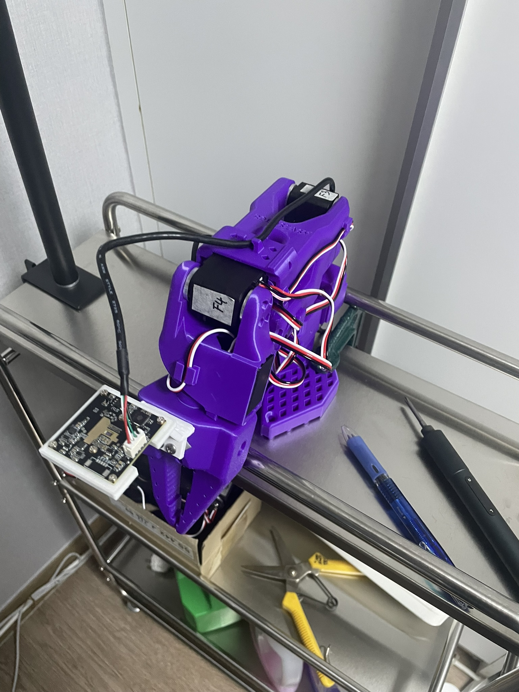

# 38 mm IMX307 Camera Mounts for SO-101 and 1/4-20 Tripods

Two printable mounts for the **38 × 38 mm IMX307 USB camera board shown in the dimension drawing**: a wrist mount for the SO-101 follower arm and a separate mount for a ball head with a standard 1/4-20 camera screw. Check the dimensions below before printing; the IMX307 sensor name alone does not guarantee that another camera board will fit.

## Downloads

| File | Use |
| --- | --- |
| [`SO101_wrist_IMX307_38mm.stl`](SO101_wrist_IMX307_38mm.stl) | Attaches the camera to the **SO-101 follower wrist** using the wrist's two M3 nut recesses. |
| [`Tripod_IMX307_38mm_quarter20_nut.stl`](Tripod_IMX307_38mm_quarter20_nut.stl) | Holds the camera above a ball head or tripod with a **1/4-20 male screw**. Requires a separate metal 1/4-20 hex nut. |

Both files use **millimetres**. Print one mount for each camera. The tripod model has no printed thread: its captive metal nut provides the 1/4-20 female thread. It is not compatible with an M6 nut.

## Photos

The intended camera and both mounts have been checked by the maker. Real installation photos can be added here:

### SO-101 wrist mount

 

### Tripod / ball-head mount

Soon, photo will be updated.

## Camera board compatibility

The mounts were designed from the supplied camera drawing, not from the IMX307 chip specification.

| Feature | Required / design value |
| --- | ---: |
| PCB width × height | **38 × 38 mm** |
| PCB thickness | **1.6 mm** |
| Mounting holes | **4 holes, Ø2 mm** |
| Hole centres | **34 × 34 mm**, centre to centre |
| Hole centre from each PCB edge | **2 mm** |
| Camera frame outside size | 44 × 44 mm |
| Camera frame opening | 30 × 30 mm, with a 14 mm wide opening at the bottom for the cable/connector area |
| Camera frame thickness | 4.2 mm |

The camera board sits **behind the frame**, with the lens pointing through its central opening. Four M2 screws secure it through the PCB mounting holes. The back is open for the connector and cable. The drawing also shows approximately 23.5 mm of lens projection and a 6 mm rear connector projection; measure other components and cable clearance on your actual camera before use.

These are open mounting frames, not sealed camera enclosures. A 38 × 38 mm board with a different lens housing, connector position, or component placement may need a modified opening.

## Hardware

**Either mount:** four M2 camera screws. M2 × 5 mm is a starting point for the 1.6 mm PCB and 4.2 mm frame; confirm the usable length against your screw heads and camera components. The printed holes are Ø1.8 mm pilot holes. Tap them for M2 or use appropriate screws for your print material; tighten only enough to secure the PCB.

**SO-101 wrist:** two M3 × 8 mm screws and two M3 hex nuts for the robot attachment, as in the [original SO-101 hex-nut wrist mount instructions](https://github.com/TheRobotStudio/SO-ARM100/blob/main/Optional/SO101_Wrist_Cam_Hex-Nut_Mount_32x32_UVC_Module/README.md). This model targets the **SO-101 follower**, not the SO-100 wrist.

**Tripod / ball head:** one standard **1/4-20 UNC hex nut**, approximately 11.11 mm across flats and no more than 5.6 mm thick. Insert it from the top of the base into the 11.5 mm across-flats, 6 mm deep hex pocket. The screw enters from underneath through a Ø6.8 mm clearance hole. The base has 4 mm of material below the nut, so check that your ball-head screw reaches and engages the nut sufficiently. The pocket is open; a small amount of adhesive at the pocket wall can keep the nut from falling out. Keep adhesive out of the threads.

## Printing and installation

Suggested starting settings: PLA or PETG, 0.2 mm layers, four walls, approximately 40% infill. Orient the **tripod mount with its base on the build plate**. Place the **wrist mount in a stable orientation** in your slicer and add supports where its angled arm needs them; the original design recommends tree supports. Check the preview for the centre opening, M2 holes and nut pocket before printing.

Attach the camera from the back of the frame. For the wrist mount, follow the [original installation sequence](https://github.com/TheRobotStudio/SO-ARM100/blob/main/Optional/SO101_Wrist_Cam_Hex-Nut_Mount_32x32_UVC_Module/README.md) for the SO-101 nut recesses and wrist screws. For the tripod mount, insert the metal nut before connecting the ball head. Route the camera cable so it does not pull on the PCB or enter the robot's moving parts.

**Fit tip from my build:** I added one layer of double-sided tape between the mating surfaces to remove a little play during installation. The spare screws supplied in the motor box also worked well for fastening the mount. Check their thread size and length against the holes and hardware listed above before tightening; the tape is a shim, not a substitute for the screws.

The two STL meshes were checked as closed, single-body models with consistent face orientation. The maker has confirmed that the mounts work with the intended camera. Other 38 mm camera boards and individual printer tolerances have not been checked.

## Design origin and licence

The wrist model modifies [TheRobotStudio's SO-ARM100 / SO-101 hex-nut wrist camera mount](https://github.com/TheRobotStudio/SO-ARM100/tree/main/Optional/SO101_Wrist_Cam_Hex-Nut_Mount_32x32_UVC_Module), originally made for a 32 × 32 mm camera. Its robot-side mounting geometry and camera-face orientation were retained; the camera frame was enlarged for a 38 × 38 mm board, its holes moved to a 34 × 34 mm pattern, and local PCB clearance was added. The tripod mount was designed separately for this camera drawing.

The original wrist mount is [Apache-2.0 licensed](https://github.com/TheRobotStudio/SO-ARM100/blob/main/LICENSE); its licence is included as [`LICENSE_original.txt`](LICENSE_original.txt).
