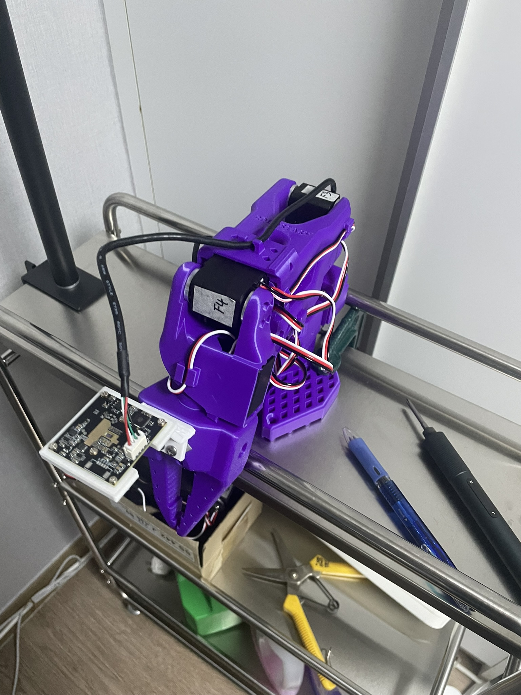
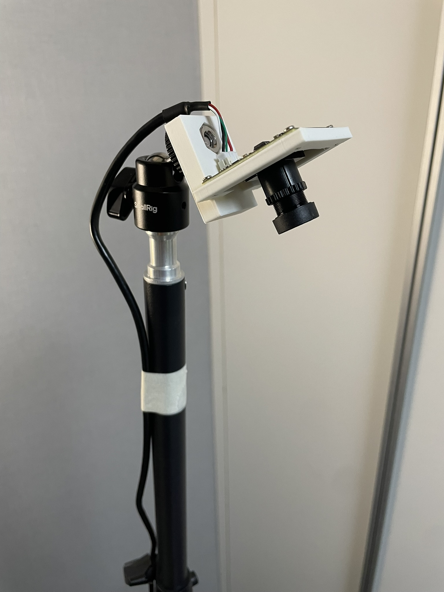

# 38 mm IMX307 Camera Mounts for SO-101 and 1/4-20 Tripods

Printable mounts for a **38 × 38 mm IMX307 USB camera board**: a wrist mount for the SO-101 follower arm and two versions of a tripod / ball-head holder with a standard 1/4-20 camera screw. Check the dimensions below before printing; the IMX307 sensor name alone does not guarantee that another camera board will fit.

## Downloads

| File | Use |
| --- | --- |
| [`SO101_wrist_IMX307_38mm.stl`](SO101_wrist_IMX307_38mm.stl) | Attaches the camera to the **SO-101 follower wrist** using the wrist's two M3 nut recesses. |
| [`Tripod_IMX307_38mm_quarter20_nut.stl`](Tripod_IMX307_38mm_quarter20_nut.stl) | **Tripod v1:** compact base; 6 mm horizontal offset to the nut axis and a 4 mm nut-pocket floor. |
| [`Tripod_IMX307_38mm_quarter20_nut_v2.stl`](Tripod_IMX307_38mm_quarter20_nut_v2.stl) | **Tripod v2:** 18 mm horizontal offset to the nut axis for more access, with a thinner 2 mm nut-pocket floor. |

All STL files use **millimetres**. Choose one mount for each camera. Both tripod versions require a separate metal **1/4-20 UNC hex nut** to provide the female thread; the printed parts have no thread. It is not compatible with an M6 nut.

## Photos

SO-101 wrist installation with the intended 38 × 38 mm camera board:

### SO-101 wrist mount

 

### Tripod / ball-head mount

Mount on ball-head mount before installing the camera module

Tripod & Ball-head mount
 

## Camera board compatibility

The mounts were designed from the supplied camera drawing, not from the IMX307 chip specification.

| Feature | Required / design value |
| --- | ---: |
| PCB width × height | **38 × 38 mm** |
| PCB thickness | **1.6 mm** |
| Mounting holes | **4 holes, Ø2 mm** |
| Hole centres | **34 × 34 mm**, centre to centre |
| Hole centre from each PCB edge | **2 mm** |
| Camera frame outside size | 44 × 44 mm |
| Camera frame opening | 30 × 30 mm, with a 14 mm wide opening at the bottom for the cable/connector area |
| Camera frame thickness | 4.2 mm |

The camera board sits **behind the frame**, with the lens pointing through its central opening. Four M2 screws secure it through the PCB mounting holes. The back is open for the connector and cable. The drawing also shows approximately 23.5 mm of lens projection and a 6 mm rear connector projection; measure other components and cable clearance on your actual camera before use.

These are open mounting frames, not sealed camera enclosures. A 38 × 38 mm board with a different lens housing, connector position, or component placement may need a modified opening.

## SO-101 wrist holder

The wrist holder fits the **SO-101 follower wrist with two M3 nut recesses**. It adapts the original 32 mm camera mount to a 38 mm camera board while keeping the robot-side attachment geometry and the orientation of the camera mounting face.

| Feature | Specification |
| --- | --- |
| Camera PCB | 38 × 38 mm, 1.6 mm thick |
| Camera PCB holes | Four Ø2 mm holes on a 34 × 34 mm centre-to-centre pattern |
| Printed camera frame | 44 × 44 mm, 4.2 mm thick |
| Frame opening | 30 × 30 mm, with a 14 mm wide bottom cable relief |
| Camera fastening | Four M2 screws; Ø1.8 mm pilot holes in the printed frame |
| Robot fastening | Two M3 × 8 mm screws and two M3 hex nuts |
| Compatible wrist | SO-101 follower; not the SO-100 wrist |

The camera sits behind the frame with the lens pointing through the opening. The wrist holder is unchanged by the tripod v2 update.

## Tripod holder: v1 and v2

Both versions fit the same camera board and use the same metal 1/4-20 nut. **v2 moves the nut horizontally away from the camera plate**, toward the back of the PCB, to give more room when tightening or loosening the connection. It also halves the floor thickness below the nut so a short ball-head screw can reach farther into the thread.

| Dimension | Tripod v1 | Tripod v2 |
| --- | ---: | ---: |
| Horizontal distance from PCB front mounting plane to nut axis | 6 mm | **18 mm** |
| Camera PCB bottom to base top | 1 mm | **1 mm** |
| Material below the nut | 4 mm | **2 mm** |
| Nut-pocket depth | 6 mm | 6 mm |
| Nut-pocket width across flats | 11.5 mm | 11.5 mm |
| Bolt clearance hole | Ø6.8 mm | Ø6.8 mm |
| Base width × depth × thickness | 28 × 26 × 10 mm | 28 × 38 × 8 mm |
| Overall width × depth × height | 44 × 26 × 52 mm | 44 × 38 × 50 mm |

The horizontal nut offset increases by **12 mm**. The camera-to-base vertical spacing and the nut-seat height relative to the camera remain the same as v1. The overall height decreases by 2 mm because the underside is thinner.

Use v1 if its compact base and screw engagement suit your setup. Choose v2 when you need more access around the nut or when the v1 floor prevents your ball-head screw from reaching the nut. With the same screw projection, v2 provides **2 mm more available thread engagement**; confirm the actual fit with your ball head.

## Hardware

**All mounts:** four M2 camera screws. M2 × 5 mm is a starting point for the 1.6 mm PCB and 4.2 mm frame; confirm the usable length against your screw heads and camera components. The printed holes are Ø1.8 mm pilot holes. Tap them for M2 or use appropriate screws for your print material; tighten only enough to secure the PCB.

**SO-101 wrist:** two M3 × 8 mm screws and two M3 hex nuts for the robot attachment, as in the [original SO-101 hex-nut wrist mount instructions](https://github.com/TheRobotStudio/SO-ARM100/blob/main/Optional/SO101_Wrist_Cam_Hex-Nut_Mount_32x32_UVC_Module/README.md). This model targets the **SO-101 follower**, not the SO-100 wrist.

**Tripod / ball head — both v1 and v2:** Insert one metal **1/4-20 UNC hex nut**, approximately 11.11 mm across flats and up to 5.6 mm thick, into the top-open pocket. The pocket is 11.5 mm across flats and 6 mm deep. The bolt passes through a Ø6.8 mm clearance hole from below. The metal nut supplies the thread; the printed part is not threaded. Check the actual screw engagement when assembling.

The material below the nut is **4 mm in v1 and 2 mm in v2**. A small amount of adhesive at the pocket wall can keep the nut from falling out when the ball head is removed. Keep adhesive out of the threads and avoid overtightening against the thinner v2 floor.

## Printing and installation

Suggested starting settings: PLA or PETG, 0.2 mm layers, four walls, approximately 40% infill. Orient the **tripod mount with its base on the build plate**. Place the **wrist mount in a stable orientation** in your slicer and add supports where its angled arm needs them; the original design recommends tree supports. Check the preview for the centre opening, M2 holes and nut pocket before printing.

Attach the camera from the back of the frame. For the wrist mount, follow the [original installation sequence](https://github.com/TheRobotStudio/SO-ARM100/blob/main/Optional/SO101_Wrist_Cam_Hex-Nut_Mount_32x32_UVC_Module/README.md) for the SO-101 nut recesses and wrist screws. For the tripod mount, insert the metal nut before connecting the ball head. Route the camera cable so it does not pull on the PCB or enter the robot's moving parts.

**Fit tip from my build:** I added one layer of double-sided tape between the mating surfaces to remove a little play during installation. The spare screws supplied in the motor box also worked well for fastening the mount. Check their thread size and length against the holes and hardware listed above before tightening; the tape is a shim, not a substitute for the screws.

The STL meshes were checked as closed, single-body models. The maker has confirmed the wrist holder and the original tripod holder fit the intended camera; the tripod v1 connection can still have limited access or insufficient screw engagement with some ball heads. The v2 exported STL was also checked for its 2 mm nut floor and open screw passages. **Physical fit of v2 has not yet been confirmed.** Other camera variants and printer tolerances have not been checked.

## Design origin and licence

The wrist model modifies [TheRobotStudio's SO-ARM100 / SO-101 hex-nut wrist camera mount](https://github.com/TheRobotStudio/SO-ARM100/tree/main/Optional/SO101_Wrist_Cam_Hex-Nut_Mount_32x32_UVC_Module), originally made for a 32 × 32 mm camera. Its robot-side mounting geometry and camera-face orientation were retained; the camera frame was enlarged for a 38 × 38 mm board, its holes moved to a 34 × 34 mm pattern, and local PCB clearance was added. The tripod mount was designed separately for this camera drawing.

The original wrist mount is [Apache-2.0 licensed](https://github.com/TheRobotStudio/SO-ARM100/blob/main/LICENSE); its licence is included as [`LICENSE_original.txt`](LICENSE_original.txt).
